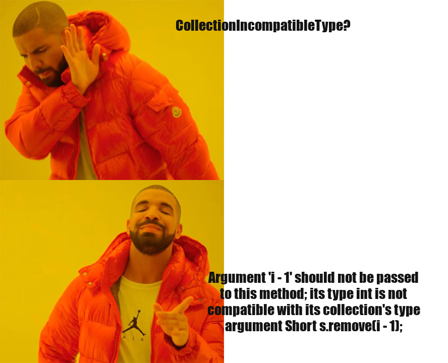
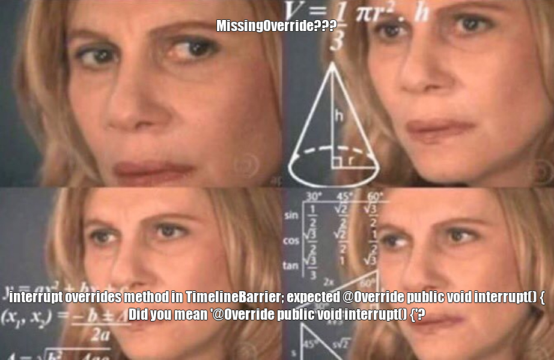

# PackHacks 2018
#### NC State University
Chris Brown

---
# Problem

### In 2017, software errors:
* impacted 3.7 billion users
* cost over $1.7 trillion 
 
 
 

http://www.tricentis.com/software-fail-watch

+++
# Problem
#### Static analysis tools exist to detect programming errors without running the code, but software developers rarely use them to check their work...

+++
# Problem

#### Researchers found that __tool output__ is one of the main reasons software engineers don't use static analysis tools.
 
 
Brittany Johnson, NC State. *Why Don't Software Developers Use Static Analysis Tools to Find Bugs*. https://people.engr.ncsu.edu/ermurph3/papers/icse13b.pdf
 
---

# Solution

#### What if I told you there was a way to improve static analysis tool output for developers?

+++

# Solution

## Memes!

---

# PackHacks Project

* Analyze code with the static analysis tool (http://errorprone.info/)[Error Prone]
* Parse the output to collect errors found by the tool
* Randomly generate memes to present errors to developers
* Generate an html file with errors, memes, and links to reported bugs

+++

# PackHacks Project

##### Examples (in case demo doesn't work)

+++

+++

---

# Thanks!

* @fa[user](Chris Brown)
* @fa[graduation-cap](NC State University)
* @fa[envelope](dcbrow10@ncsu.edu)
* @fa[github](chbrown13)
* @fa[code](www4.ncsu.edu/~dcbrow10)

